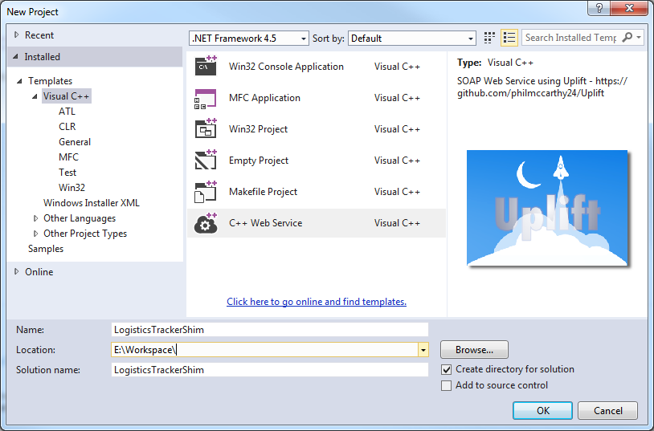

# Uplift

**A SOAP web service library for C++**
- That's open source
- Targetted at Windows / Visual Studio 2013+ development (though Linux development may be supported at a later date)

## Overview

Uplift is a web service library - in a nutshell, it makes it simple to call native C++ code from any language, on any platform (be that a Perl script running on the same box, or a NodeJS client running on Linux on the other side of the world). It works by running in a web server, and exposing a *service interface* using the [Simple Object Access Protocol](https://en.m.wikipedia.org/wiki/SOAP).

Uplift comes packaged as a Visual Studio "New Project" template, and is distributed as a [VSIX file](https://blogs.msdn.microsoft.com/quanto/2009/05/26/what-is-a-vsix/), for ease of installation. The project template makes use of a build-time code generation system to create SOAP artifacts from a C++ service interface header file that you define. It is very simple to create a basic C++ web service, and debug your service methods from Visual Studio attached to an IIS Express instance.  

## Quick start guide

- Download the latest VSIX release, or [build it yourself](~/#BuildInstructions).
- Double-click the VSIX to install the Uplift Template Project into Visual Studio
- Open Visual Studio, select File->New->Project. The following screen will appear:

Early days at the moment. Check out the source code, the open issues on github, and please feel free to contribute!

## Why?

Many SOAP libraries already exist - a popular one for C++ is [gSoap](https://www.genivia.com/products.html). C++ isn't particularly well suited for the creation of web services, due to its strong typing and lack of introspection; use of SOAP for web services is also on the decline, with the lighter weight REST paradigm becoming more common.

However:

- REST isn't applicable in all situations - sometimes services can't easily be represented as a set of resources, and an RPC model (operations on data-in-flight) is necessary
- SOAP is still a very widely used, standard way to implement web services
- There are not many SOAP libraries that have a commercially permissive licence - gSoap is GPL. Uplift is MIT, fine to use in commercial projects
- Projects don't always start from scratch. Uplift is aimed at projects where lots of existing C++ code would benefit from being made more interoperable with different languages and platforms, as part of a wider architecture.
- Personal experience has shown that using additional layers eg .NET interop to make C++ code interface with higher language web service frameworks (eg WCF) doesn't work well. The resultant code base is complex, unwieldy and unfamiliar to C++ developers.

### What's different about Uplift?

- Uplift has been targetted at Windows software development using Visual Studio 2013+. While multi-platform source code hasn't been ruled out, there will be project templates made specifically for Visual Studio to make it very easy to get started with C++ web service development on Windows.
- It uses a developer friendly code-first approach; gSoap needs an existing WSDL to generate service stubs and serialisers for instance, whereas Uplift generates the WSDL, stubs and serialisers from a C++ service interface header file.

## How it works

Uplift uses the [ISAPI](https://en.m.wikipedia.org/wiki/Internet_Server_Application_Programming_Interface) interface to operate with web servers such as Microsoft IIS. Uplift services are dlls that are dynamically loaded by the web server when a uri with a path to the dll is requested by a SOAP client.

The SOAP 1.1 (SOAP 1.2 and MTOM support are future goals) request is then deserialised from XML to C++ service class parameters, the service class function is invoked, the service does its work, and then a return value is serialised back to XML and returned to the client over http as a SOAP response packet (or Fault if there was an error).

The XML serialisers (C++ source files), service implementation stubs and WSDL file are auto-generated at Visual Studio project build-time by the Uplift hpp2soap system.

## Pre-requisites

- Windows 7+
- Visual Studio 2013+
- [Visual Studio SDK](https://www.microsoft.com/en-gb/download/details.aspx?id=40758) (if running 2013)

---

## <a href="BuildInstructions">Prototype build instructions</a>

Open source/Uplift.sln in VS2013.

Build and run, IIS Express should load, go to http://localhost:8080/test/IsapiExtDll.dll to see the test service status page.
